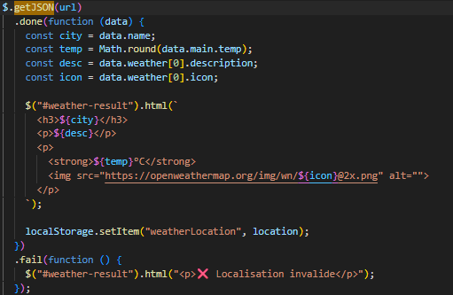

# Intégration d’une API externe avec JavaScript

## Définition
Une API permet à une application web de communiquer avec un service
externe afin de récupérer ou envoyer des données via des requêtes HTTP.

## Contexte d’utilisation
Les API sont utilisées pour afficher des données dynamiques ou en temps
réel, comme la météo, des statistiques ou des informations externes.

## Implémentation dans le projet
Le Dashboard utilise l’API OpenWeatherMap pour afficher la météo en temps
réel selon une localisation saisie par l’utilisateur. Les données sont
récupérées via une requête AJAX avec jQuery et affichées dynamiquement.

## Exemple de code

## Pièges à éviter
- Ne pas gérer les erreurs de requête
- Ne pas afficher d’état de chargement
- Exposer une clé API sans précautions
- Supposer que la structure des données est toujours identique

## Analyse personnelle
Cette intégration m’a permis de comprendre le fonctionnement des API REST
et l’importance de la gestion des erreurs. J’ai réalisé que l’expérience
utilisateur est aussi importante que la récupération des données.

## Sources
- https://developer.mozilla.org/fr/docs/Web/API/Fetch_API
- https://openweathermap.org/api
