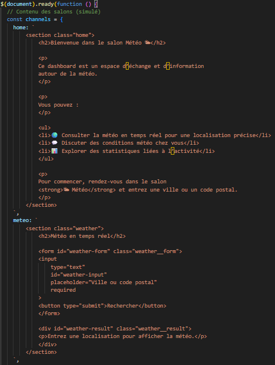

# Architecture d’un dashboard web multi-salons

## Définition
Un dashboard multi-salons est une application web dans laquelle
le contenu principal change dynamiquement en fonction de la navigation,
sans rechargement de la page.

## Contexte d’utilisation
Cette architecture est adaptée aux interfaces de type :
- tableau de bord
- application de discussion
- outils collaboratifs (inspiration Discord / Slack)

## Exemple de code

## Implémentation dans le projet
Dans ce projet, les différents salons (Accueil, Météo, Discussions,
Statistiques, Paramètres) sont définis sous forme de contenus HTML
stockés dans un objet JavaScript (`channels`).

Le clic sur un élément de la sidebar déclenche :
- le changement du salon actif
- la mise à jour du titre
- le remplacement dynamique du contenu principal

## Pièges à éviter
- Dupliquer le contenu HTML dans plusieurs fichiers
- Mélanger la logique de navigation avec le HTML
- Ne pas gérer l’état actif de la navigation

## Analyse personnelle
Cette approche m’a permis de comprendre comment structurer une application
web dynamique sans framework. Elle m’a également sensibilisé à
l’importance de l’organisation du code lorsque l’interface devient
plus complexe.

## Sources
- https://developer.mozilla.org/fr/docs/Web/API/Document_Object_Model
- https://developer.mozilla.org/fr/docs/Learn/JavaScript/Client-side_web_APIs/Manipulating_documents
