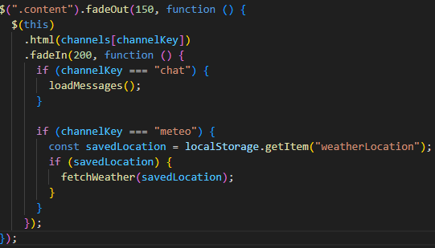

# Manipulation du DOM avec jQuery

## Définition
La manipulation du DOM consiste à modifier dynamiquement le contenu et la
structure d’une page web à l’aide de JavaScript.

## Contexte d’utilisation
jQuery facilite la manipulation du DOM en simplifiant :
- la sélection des éléments
- la gestion des événements
- les animations et transitions

## Implémentation dans le projet
Dans le Dashboard, jQuery est utilisé pour :
- gérer les clics sur les éléments de la sidebar
- injecter dynamiquement du contenu dans la zone principale
- appliquer des animations lors du changement de salon
- gérer des formulaires dynamiques (météo, chat)

## Exemple de code

## Pièges à éviter
- Attacher des événements sur des éléments générés dynamiquement sans
  délégation
- Mélanger logique métier et animations
- Multiplier les sélections DOM inutiles

## Analyse personnelle
L’utilisation de jQuery m’a permis de mieux comprendre le fonctionnement du
DOM et la gestion des interactions utilisateur. Cela m’a aidé à structurer
mes scripts avant d’envisager des solutions plus modernes.

## Sources
- https://api.jquery.com/
- https://learn.jquery.com/using-jquery-core/

