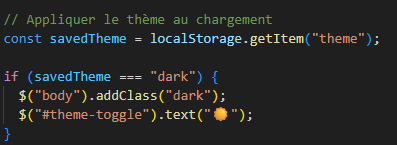

# Persistance des données avec localStorage

## Définition
`localStorage` est une API du navigateur permettant de stocker des données
localement de manière persistante, même après la fermeture du navigateur.

## Contexte d’utilisation
Elle est utilisée pour :
- sauvegarder des préférences utilisateur
- conserver des données temporaires
- améliorer l’expérience utilisateur sans base de données

## Implémentation dans le projet
Dans le Dashboard, `localStorage` est utilisé pour :
- mémoriser le thème clair ou sombre
- conserver la localisation météo
- sauvegarder les messages du chat

Les données complexes sont stockées sous forme de chaînes JSON.

## Exemple de code

## Pièges à éviter
- Stocker des données sensibles
- Oublier de convertir les données avec `JSON.stringify` et `JSON.parse`
- Ne pas vérifier l’existence d’une clé avant utilisation

## Analyse personnelle
Cette fonctionnalité m’a permis de comprendre comment rendre une
application plus agréable à utiliser sans mettre en place un backend. J’ai
pris conscience des limites de `localStorage` et de ses cas d’usage
appropriés.

## Sources
- https://developer.mozilla.org/fr/docs/Web/API/Window/localStorage
- https://developer.mozilla.org/fr/docs/Web/API/Web_Storage_API
