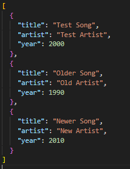

# Utilisation d’un fichier JSON comme base de données locale

## Définition
Un fichier JSON permet de stocker des données structurées de manière
lisible et facilement exploitable en JavaScript.

## Contexte d’utilisation
Le JSON est souvent utilisé pour :
- stocker des données de test
- simuler une base de données
- séparer les données de la logique applicative

## Implémentation dans le projet
Le fichier `songs.json` contient les informations des chansons :
titre, artiste, année de sortie et lien audio.
Ces données sont chargées via `fetch()` au démarrage du jeu.

## Exemple de code

## Pièges à éviter
- Modifier la structure du JSON sans adapter le code
- Ne pas gérer les erreurs de chargement
- Mélanger données et logique dans le même fichier

## Analyse personnelle
L’utilisation de JSON m’a permis de rendre le jeu plus flexible.
Il est possible de changer de playlist sans modifier le code JavaScript.

## Sources
- https://developer.mozilla.org/fr/docs/Web/JavaScript/Reference/Global_Objects/JSON
- https://developer.mozilla.org/fr/docs/Web/API/Fetch_API
