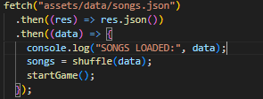

# Randomisation des données en JavaScript

## Définition
La randomisation consiste à mélanger l’ordre des éléments d’un tableau
afin de produire des résultats différents à chaque partie.

## Contexte d’utilisation
Elle est utilisée dans les jeux pour :
- éviter la répétition
- augmenter la rejouabilité
- surprendre le joueur

## Implémentation dans le projet
Dans le Music Timeline Game, les chansons sont mélangées à l’aide
d’une fonction `shuffle()` basée sur `Array.sort()`.

Les cartes sont ensuite tirées une à une avec `pop()`.

## Exemples de code

## Pièges à éviter
- Utiliser une randomisation biaisée
- Modifier le tableau original sans copie
- Ne pas vérifier si le tableau est vide

## Analyse personnelle
Cette fonctionnalité m’a fait prendre conscience que certaines méthodes
simples de randomisation ont des limites, mais restent suffisantes
dans un contexte pédagogique.

## Sources
- https://developer.mozilla.org/fr/docs/Web/JavaScript/Reference/Global_Objects/Array/sort
- https://javascript.info/array-methods
